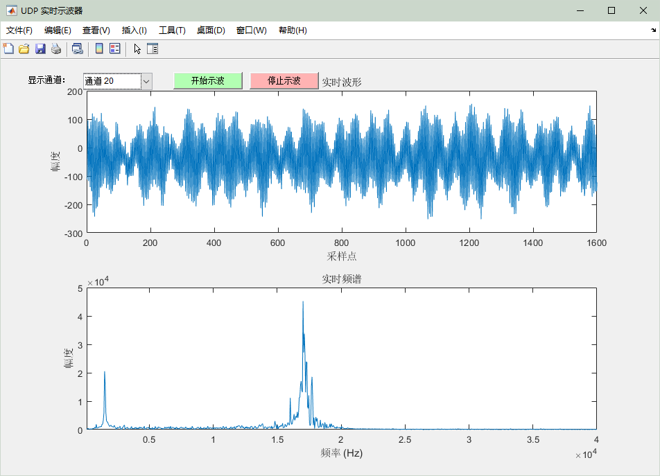

[](https://github.com/wavefrag/WaveFrag-Acoustic-Camera/releases)
[](https://github.com/wavefrag/WaveFrag-Acoustic-Camera/actions)
[](LICENSE)

# WaveFrag-Acoustic-Camera
WaveFrag 声学相机提供高性能声学成像与信号处理系统，适用于实验室和个人开发者进行多通道声源定位与分析。  
WaveFrag Acoustic Camera provides a high-performance acoustic imaging and signal processing system, suitable for labs and individual developers for multi-channel source localization and analysis.

## Wiki 文档 / Wiki Documentation
项目文档在 GitHub Wiki 中维护，方便查看和持续更新：  
The project documentation is maintained on GitHub Wiki for easy access and continuous updates:
- 📖 [Home](https://github.com/wavefrag/WaveFrag-Acoustic-Camera/wiki/Home)
- 🚀 [Getting Started](https://github.com/wavefrag/WaveFrag-Acoustic-Camera/wiki/Getting_Started)
- 🛠 [Hardware](https://github.com/wavefrag/WaveFrag-Acoustic-Camera/wiki/Hardware)
- 💻 [Software](https://github.com/wavefrag/WaveFrag-Acoustic-Camera/wiki/Software)
- ⚠️ [Troubleshooting](https://github.com/wavefrag/WaveFrag-Acoustic-Camera/wiki/Troubleshooting)
- 📑 [API Reference (optional)](https://github.com/wavefrag/WaveFrag-Acoustic-Camera/wiki/API_Reference)

## Hardware Features / 硬件功能
- 多通道麦克风阵列采集 / Multi-channel microphone array acquisition
- 可配置网络参数 / Configurable network parameters
- 即插即用 / Plug and Play
- 可配置硬件滤波器参数 / Configurable hardware filter parameters

## Software Features / 软件功能
- 多通道麦克风阵列采集 / Multi-channel microphone array acquisition
- 实时声源定位与声压图生成 / Real-time source localization and SPL map generation
- 数据可视化功能 / Data visualization
- 支持 FFT、Beamforming 等信号处理算法 / Support FFT, Beamforming and other signal processing algorithms

## Installation / 安装
### GUI 软件 / GUI Software
- Windows / Linux / MacOS 可执行程序包 / Executable package for Windows, Linux, MacOS
- 安装指南详见 [Getting Started](https://github.com/wavefrag/WaveFrag-Acoustic-Camera/wiki/Getting_Started) / Installation guide see [Getting Started](https://github.com/wavefrag/WaveFrag-Acoustic-Camera/wiki/Getting_Started)

## Example / 示例
以下示例展示如何使用 Matlab 配合本设备进行声源定位：  
This example shows how to use Matlab with the device for source localization:

```matlab
clc;
clear;
% 添加示例 Matlab 代码 / Add example Matlab code here
```



## Troubleshooting & FAQ / 常见问题
- 常见问题与解决方法请参见 [Troubleshooting](https://github.com/wavefrag/WaveFrag-Acoustic-Camera/wiki/Troubleshooting)  
For common issues and solutions, please refer to [Troubleshooting](https://github.com/wavefrag/WaveFrag-Acoustic-Camera/wiki/Troubleshooting)

## License / 许可
WaveFrag-Acoustic-Camera 遵循 MIT License。详见 [LICENSE](LICENSE)  
WaveFrag-Acoustic-Camera is licensed under MIT License. See [LICENSE](LICENSE)

## Contact / Support / 联系方式
- 技术支持邮箱 / Support Email: support@wavefrag.com
- 论坛与讨论 / Forum and Discussions: [GitHub Discussions](https://github.com/wavefrag/WaveFrag-Acoustic-Camera/discussions)
