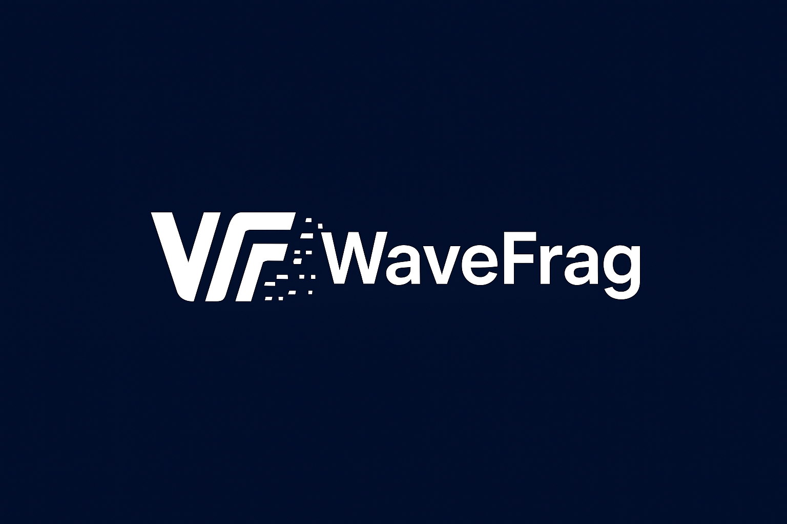

# WaveFrag-Acoustic-Camera
专注于高性能声学成像与信号处理系统。我们研发声学相机与阵列采集设备，并为开发者提供实用的案例。

- 📦 [声学相机项目](https://github.com/wavefrag/WaveFrag-Acoustic-Camera)
- 💻 [软件Demo与接口文档](https://github.com/wavefrag/WaveFrag-sdk)
- 📖 [使用说明与开发文档](https://github.com/wavefrag/WaveFrag-Acoustic-camera/wiki)

**Wave Fragment**  
希望能和您一起探索声学世界的无限可能。
